# 🎟️ Plataforma de Rifas Online

Bienvenido a la plataforma de rifas en línea. Esta aplicación permite a los usuarios participar en rifas seleccionando números y subiendo comprobantes de pago, mientras que los administradores pueden gestionar rifas, validar reservas y controlar todo desde un panel exclusivo.


---

## 🚀 Vista Previa capture

### 🧑 Cliente
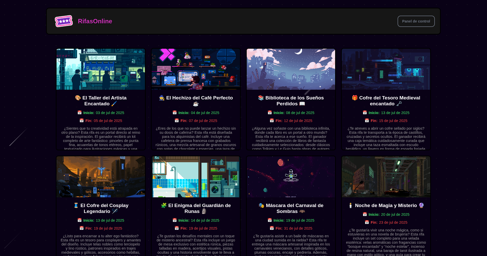

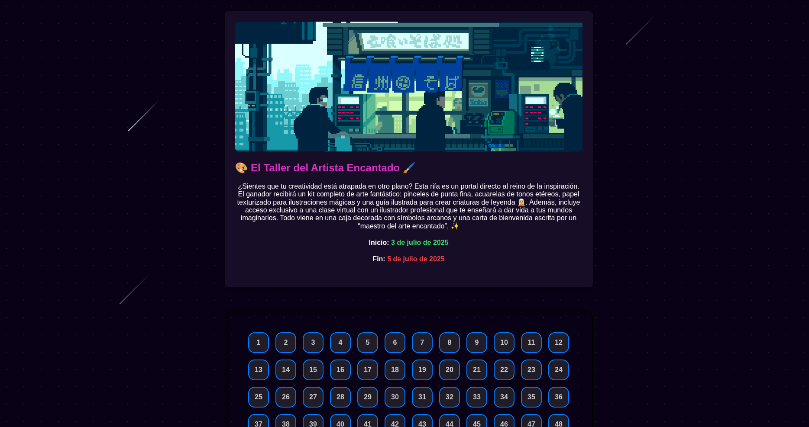

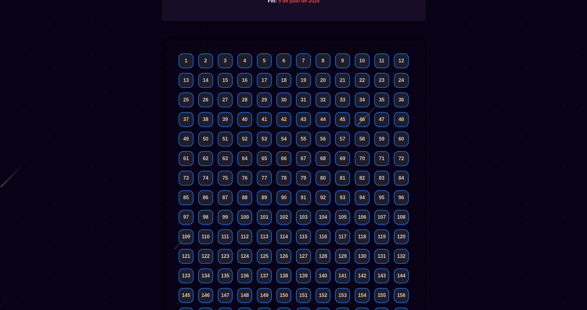

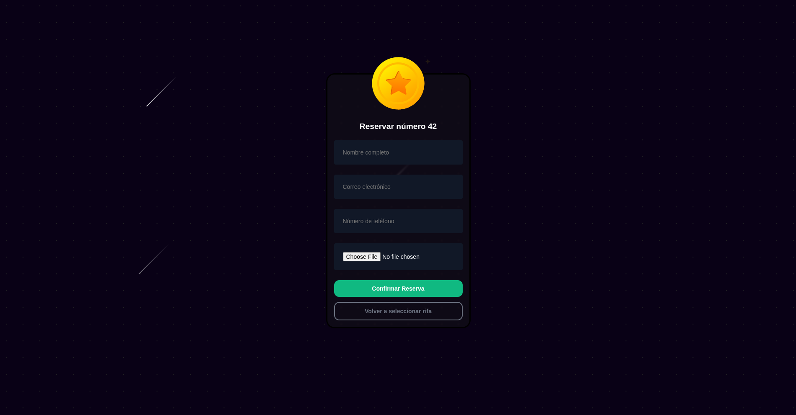

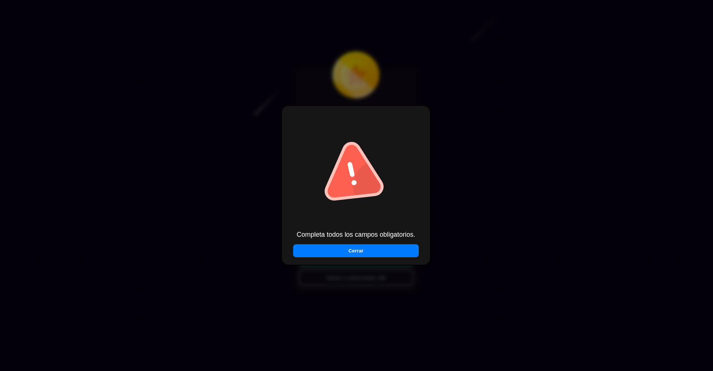

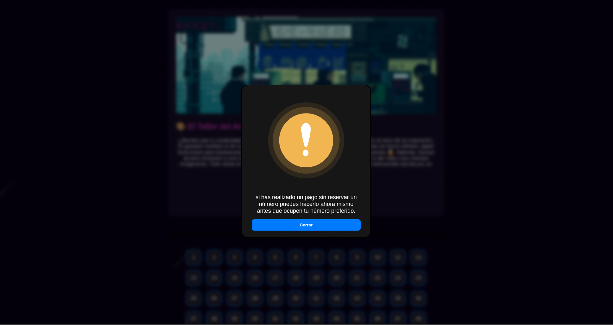

---

### 👨‍💻 Panel de Administración


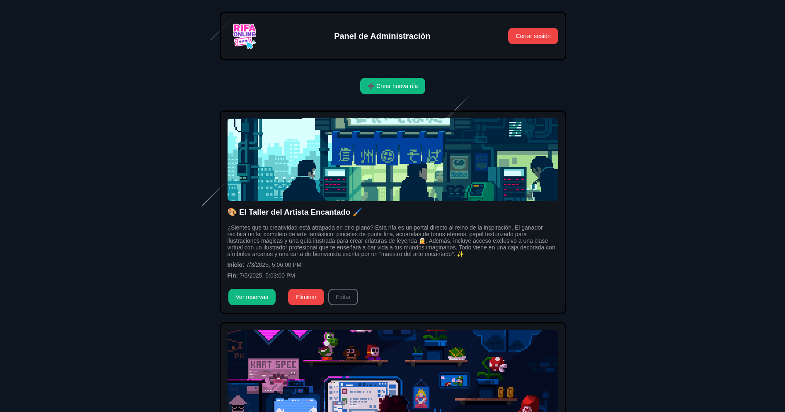


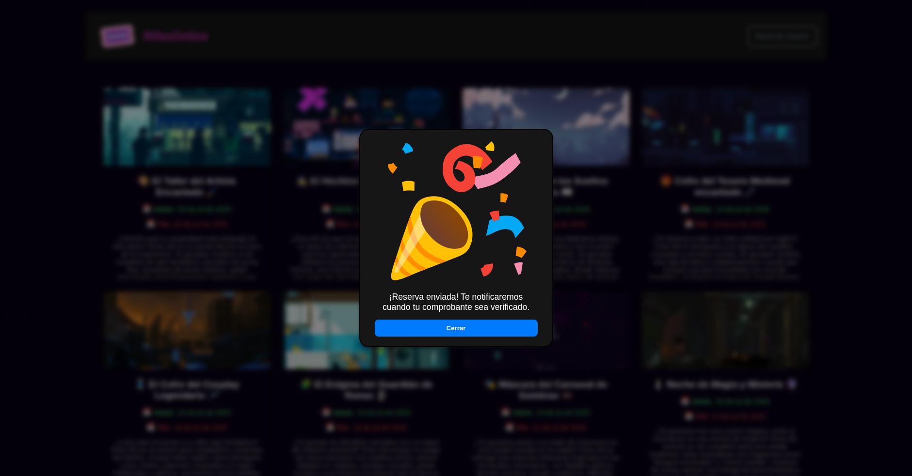

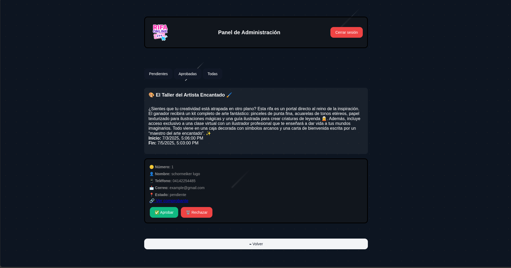

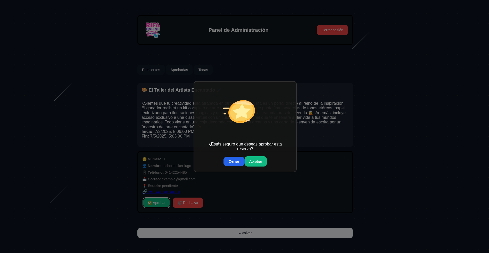

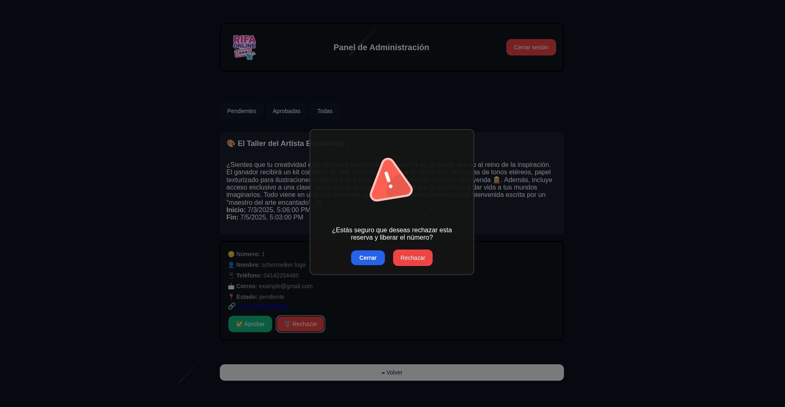

---

## ✨ Características

- 🎯 Clientes pueden seleccionar números, ver rifas activas y subir comprobantes.
- 🧑‍💼 Panel de administrador para gestionar rifas, validar reservas y editar información.
- 💾 Conexión directa a Supabase (auth, storage y base de datos).
- 💡 Estructura modular por funcionalidades (UI, reservas, rifas, etc).
- ⚡ Animaciones con CSS.
- 📁 Proyecto 100% frontend, sin necesidad de servidor adicional.

---

## 🛠️ Tecnologías Utilizadas

| Frontend       | Backend / BDD   | Utilidades       |
|----------------|------------------|------------------|
| HTML, CSS, JS  | Supabase (PostgreSQL + Auth + Storage) | Modales personalizados |
| Animaciones CSS | | Validación visual con clases CSS |

---

## 📁 Estructura del Proyecto

```plaintext
plataforma-rifas/
│
├── public/                    # Archivos HTML y estáticos
│   ├── index.html             # Vista cliente
│   ├── admin.html             # Panel de administración
│   └── assets/
│       ├── css/
│       │   ├── cliente.css
│       │   └── admin.css
│       └── img/
│           └── logo.png
│
├── cliente/                   # Módulos para vista cliente
│   ├── appCliente.js
│   ├── rifasUI.js
│   ├── numerosUI.js
│   ├── reservasCliente.js
│   └── uiHelpers.js
│
├── admin/                     # Módulos del panel admin
│   ├── admin.js
│   ├── supabaseClient.js
│   ├── rifasAdmin.js
│   ├── formRifasAdmin.js
│   ├── editarRifa.js
│   ├── reservasAdmin.js
│   ├── modalAdmin.js
│   ├── utilsAdmin.js
│   └── uiAdminHelpers.js
│
└── README.md                  # Este archivo
``` 
## 🔐 Acceso al Panel de Administración
Para entrar al panel de administración:

Accede a /admin.html

Inicia sesión con tus credenciales de Supabase Auth

Una vez validado:

Verás el encabezado del panel

Accederás a las rifas y reservas

Podrás editar, eliminar o aprobar reservas

## 🧪 Estado del Proyecto
✅ MVP funcional completo

🔜 En desarrollo:

 Separación por microservicios con API REST.

 Empaquetado con Docker.

 Pagos automáticos (MercadoPago, Stripe, bitcoin, etc.)

 Historial de ganadores.

 Sistema de notificaciones.

 integrar preloader para los procesos de subida multimedia.

🧠 ## Créditos y Agradecimientos

🧑‍💻 Desarrollado por: Schormeiker Lugo

❤️ Gracias a Supabase por ofrecer una suite backend tan completa.
